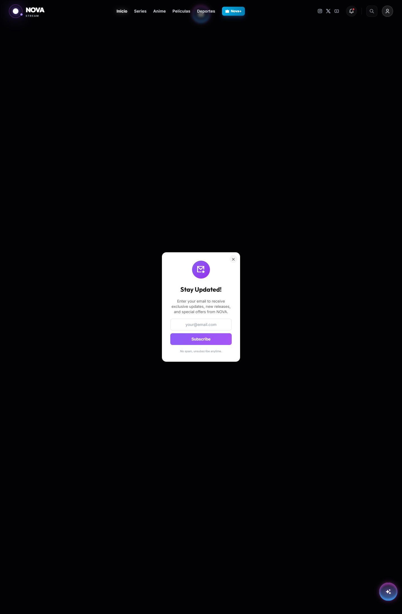
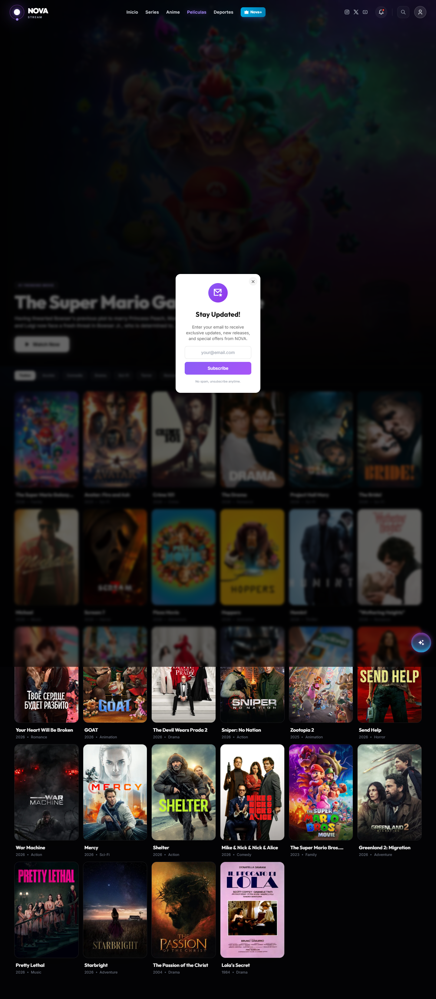
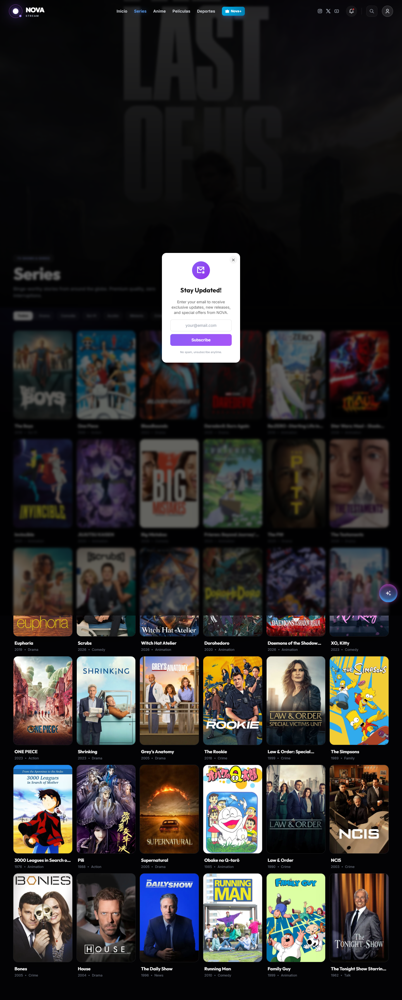
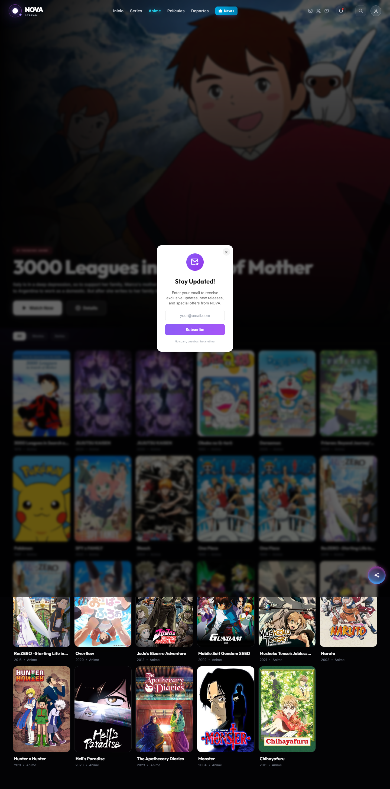
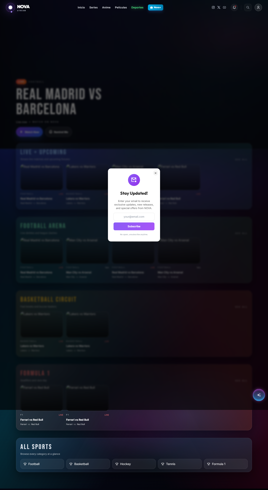
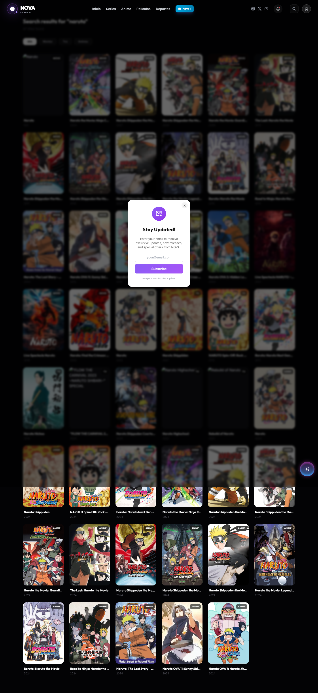
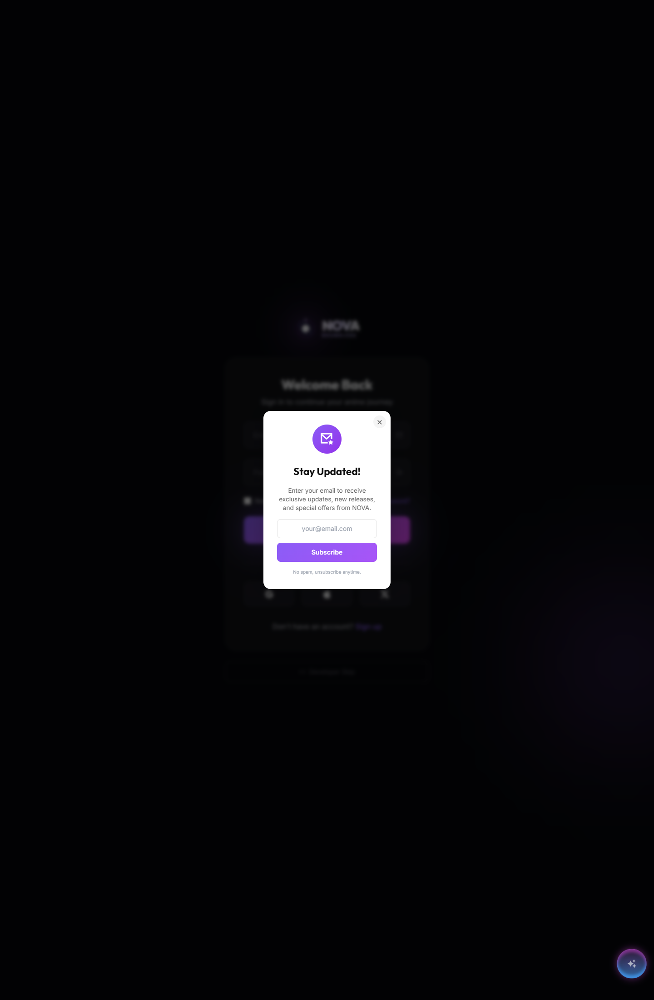
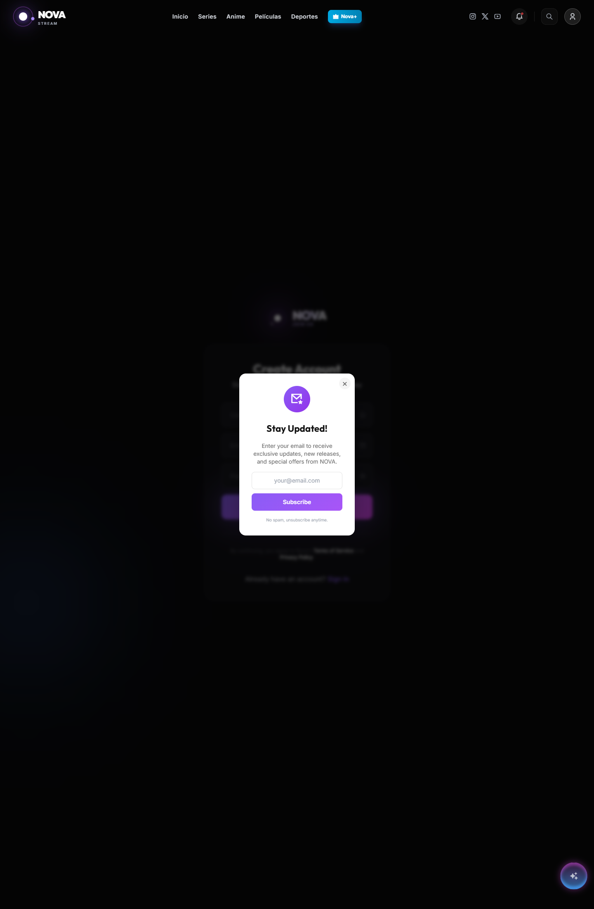
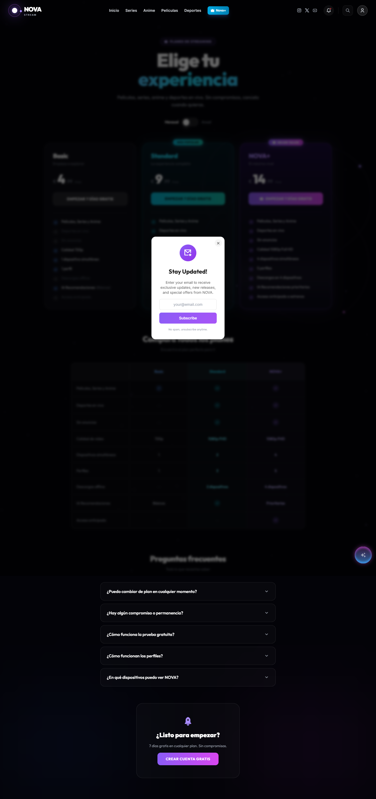
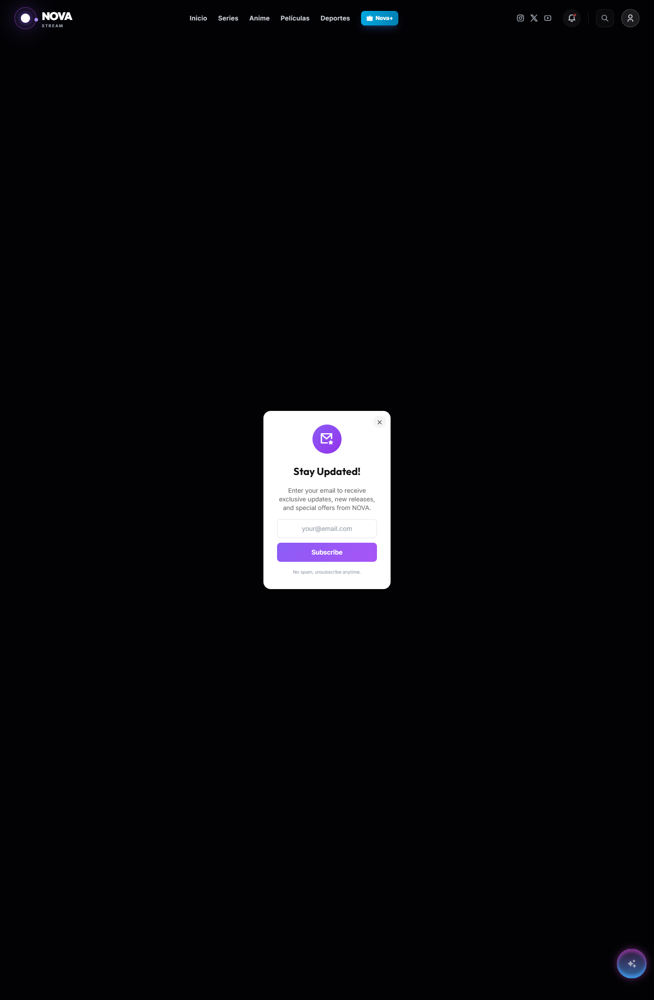

# MEMORIA DEL MÒDUL DE SÍNTESI

## Projecte

**Títol del projecte:** NOVA Streaming Platform  
**Autor:** Owais  
**Curs:** SMX2 2024-2025

---

## Índex

1. Introducció  
2. Fitxa del projecte  
3. Requeriments del projecte  
4. Arquitectura de l'entorn de desenvolupament  
5. Arquitectura de l'entorn de producció  
6. Base de dades i model ER  
7. Funcionalitats principals  
8. Flux de navegació de pantalles  
9. Disseny visual i look & feel  
10. Política de backup i recovery  
11. Gestió d'usuaris i rols  
12. Configuració de servidors i desplegament  
13. Desenvolupament tècnic del projecte  
14. Captura de pantalles  
15. Conclusions  
16. Bibliografia i webgrafia  
17. Annex. Guia de captures pendents

---

## 1. Introducció

NOVA és una plataforma web de streaming desenvolupada com a projecte de síntesi. L'objectiu principal ha estat crear una aplicació moderna capaç d'oferir en una mateixa interfície pel·lícules, sèries, anime i esports en directe, incorporant autenticació d'usuaris, perfils, historial de visualització, llista personal, configuració de preferències i un backend propi per centralitzar les peticions externes.

El projecte no s'ha plantejat com un simple catàleg estàtic, sinó com una aplicació completa tipus SPA, amb frontend en React i backend en Hono/Bun. També s'ha integrat Supabase per a l'autenticació i emmagatzematge de dades d'usuari, i Stripe per gestionar la part de subscripcions.

La finalitat del projecte ha estat aplicar coneixements de desenvolupament web, desplegament, bases de dades, integració d'APIs, seguretat bàsica, persistència de dades i documentació tècnica.

---

## 2. Fitxa del projecte

**Nom:** NOVA Streaming Platform  
**Tipologia:** Aplicació web  
**Frontend:** React, TypeScript, Vite, Tailwind CSS  
**Backend:** Bun + Hono  
**Base de dades i autenticació:** Supabase  
**Pagaments:** Stripe  
**Fonts externes de dades:** TMDB, anime API i servei d'esports  
**Desplegament del frontend:** Netlify  
**Desplegament del backend:** Vercel  
**URL pública del projecte:** https://nova-streaming-app.netlify.app  

### Objectius principals

- Crear una plataforma de streaming amb interfície moderna.
- Separar frontend i backend per millorar manteniment.
- Implementar autenticació amb registre i inici de sessió.
- Permetre perfils, watchlist i historial.
- Integrar contingut multimèdia i esports en directe.
- Disposar d'un sistema escalable amb desplegament real.

---

## 3. Requeriments del projecte

### 3.1 Requeriments funcionals

- L'usuari ha de poder visualitzar pel·lícules, sèries, anime i esports.
- L'usuari ha de poder registrar-se i iniciar sessió.
- El sistema ha de permetre crear i seleccionar perfils.
- L'usuari ha de poder afegir contingut a la seva llista.
- El sistema ha de guardar l'historial de reproducció.
- L'usuari ha de poder modificar preferències des de configuració.
- El sistema ha de permetre cercar contingut.
- La plataforma ha de mostrar informació actualitzada procedent d'APIs externes.
- El backend ha de actuar com a capa intermèdia per protegir claus i controlar rutes.

### 3.2 Requeriments no funcionals

- Interfície responsive per ordinador i mòbil.
- Navegació ràpida sense recàrregues completes.
- Codi modular i escalable.
- Persistència de dades d'usuari.
- Control d'accés a dades amb polítiques RLS a Supabase.
- Possibilitat de desplegament en producció.
- Manteniment senzill mitjançant separació per components i serveis.

### 3.3 Requeriments mínims i opcionals aplicats

**Mínims treballats**

- Disseny de l'arquitectura de desenvolupament.
- Disseny de l'arquitectura de producció.
- Gestió d'usuaris amb rols i dades pròpies.
- Captura de pantalles de l'aplicació.
- Gestió de servidor web i desplegament.
- Política de backup i recovery.
- Desenvolupament documentat de parts significatives.

**Opcionals o ampliacions**

- Integració de chatbot/assistència.
- Integració de Stripe per subscripcions.
- Notificacions internes.
- Persistència de configuració d'usuari.
- Secció d'esports en directe.

---

## 4. Arquitectura de l'entorn de desenvolupament

L'entorn de desenvolupament està dividit en dues parts principals:

- `nova-frontend`: aplicació React amb Vite.
- `nova-backend`: API pròpia feta amb Hono i Bun.

### Estructura de treball

- El frontend s'encarrega de la interfície, navegació, contextos i consum de dades.
- El backend actua com a proxy i com a capa de lògica per a anime, esport, TMDB, autenticació auxiliar i Stripe.
- Supabase s'utilitza per a l'autenticació i dades persistents.

### Funcionament local

- Frontend: `npm run dev`
- Backend: `bun run dev`
- Frontend habitualment en `http://localhost:5173`
- Backend en `http://localhost:3000`

### Avantatges d'aquesta arquitectura

- Separació clara de responsabilitats.
- Major seguretat perquè les claus no passen directament al client.
- Facilitat per escalar o substituir serveis.
- Manteniment més ordenat.

---

## 5. Arquitectura de l'entorn de producció

En producció el projecte queda dividit en diversos serveis:

- **Netlify**: allotja el frontend compilat.
- **Vercel**: allotja el backend i les rutes API.
- **Supabase**: base de dades PostgreSQL, autenticació i polítiques de seguretat.
- **Stripe**: passarel·la de subscripcions.
- **TMDB / Anime API / Sports API**: fonts de contingut.

### Flux general

1. L'usuari obre la web a Netlify.
2. El frontend renderitza les pantalles i fa peticions a `/api/...`.
3. Les peticions es reescriuen al backend desplegat a Vercel.
4. El backend consulta serveis externs o Supabase.
5. Les dades tornen al frontend i es mostren a la interfície.

### Reescriptures detectades

- Netlify i Vercel utilitzen configuració de SPA.
- Existeix redirecció de `/api/*` cap al backend desplegat.
- Això permet mantenir una sola URL pública per a l'usuari final.

---

## 6. Base de dades i model ER

El projecte utilitza Supabase sobre PostgreSQL. Les taules principals detectades en l'esquema i documentació del projecte són:

- `profiles`
- `watchlist`
- `watch_history`
- `user_settings`
- `notifications`
- `leads`
- `subscriptions`

### Relacions principals

- `auth.users` 1:N `profiles`
- `auth.users` 1:N `watchlist`
- `auth.users` 1:N `watch_history`
- `auth.users` 1:1 `user_settings`
- `auth.users` 1:N `notifications`
- `auth.users` 1:1 o 1:N `subscriptions`

### Descripció del model

- `profiles`: desa els perfils d'una mateixa compte.
- `watchlist`: desa el contingut guardat per veure més tard.
- `watch_history`: desa el progrés de visualització.
- `user_settings`: desa idioma, autoplay, aparença i altres preferències.
- `notifications`: desa avisos interns.
- `leads`: desa correus de formularis o popups.
- `subscriptions`: desa l'estat de la subscripció associada a Stripe.

### Model ER proposat per inserir a la memòria

Insereix aquí un diagrama ER fet amb Draw.io, diagrams.net o dbdiagram amb aquestes entitats:

- `users`
- `profiles`
- `watchlist`
- `watch_history`
- `user_settings`
- `notifications`
- `subscriptions`

**Captura recomanada:** editor del model ER o exportació PNG del diagrama.

---

## 7. Funcionalitats principals

### 7.1 Pantalla d'inici

La home mostra un banner dinàmic, seccions de tendència i files de contingut per categories. També inclou una secció de contingut esportiu i un banner promocional.



### 7.2 Catàleg de pel·lícules

La secció de pel·lícules carrega contingut de TMDB, permet filtrar per gènere i obrir el reproductor corresponent.



### 7.3 Catàleg de sèries

La secció de sèries utilitza el mateix model general, però adaptat a contingut televisiu i temporades.



### 7.4 Catàleg d'anime

La secció d'anime agrega diversos resultats, filtra títols disponibles i permet obrir detall o reproducció.



### 7.5 Esports en directe

La pàgina d'esports consulta esdeveniments en viu i valida que existeixin streams abans de mostrar-los com a reproduïbles.



### 7.6 Cercador global

La cerca unifica pel·lícules, sèries i anime, i mostra resultats filtrables.



### 7.7 Autenticació

El projecte disposa de pantalles específiques per login i registre.





### 7.8 Plans i subscripcions

L'arquitectura contempla una secció de plans i integració amb Stripe. A la còpia actual del codi, el fitxer `src/pages/Plans.tsx` es troba buit, però hi ha evidència del disseny anterior a la carpeta de backup i també existeix el backend de Stripe, la taula `subscriptions` i la documentació funcional dels plans.

Per tant, a la memòria cal explicar que:

- la funcionalitat ha estat dissenyada,
- el backend de pagament existeix,
- la documentació funcional dels plans està definida,
- però l'estat actual del fitxer principal de plans s'ha de revisar abans de l'entrega final.



### 7.9 Política de privacitat i termes

El projecte també inclou pàgines informatives legals.




---

## 8. Flux de navegació de pantalles

El flux de navegació principal del sistema és el següent:

1. L'usuari entra a la home.
2. Pot navegar a Anime, Pel·lícules, Sèries o Esports.
3. Pot cercar contingut des de la barra de navegació.
4. Si vol funcionalitats personals, es registra o inicia sessió.
5. Després del login, selecciona perfil.
6. A partir d'aquí pot accedir a My List, History, Settings i reproducció.

### Diagrama de flux recomanat

Insereix un diagrama amb aquesta seqüència:

- `Home`
- `Login / Signup`
- `Profiles`
- `Catalogs`
- `Watch`
- `My List`
- `History`
- `Settings`

**Captura recomanada:** diagrama fet amb fletxes simples a Draw.io.

---

## 9. Disseny visual i look & feel

El disseny de NOVA utilitza una estètica moderna inspirada en plataformes OTT. Els elements principals del look & feel són:

- Fons foscos amb gradients i efectes lluminosos.
- Hero banners grans amb imatges de fons.
- Targetes de contingut amb hover i animacions.
- Ús de color accent per destacar accions.
- Tipografia clara, jerarquia visual i navegació superior persistent.

També s'han treballat efectes visuals com:

- transicions de càrrega,
- animacions de hover,
- overlays per millorar llegibilitat,
- filtres i categories visualment diferenciades.

Aquest estil reforça la sensació de producte premium.

---

## 10. Política de backup i recovery

El projecte mostra diverses carpetes de backup dins del workspace, fet que indica una política de còpies periòdiques durant el desenvolupament.

### Components a protegir

- Codi font del frontend.
- Codi font del backend.
- Fitxers de configuració.
- Esquema de Supabase.
- Dades de producció a Supabase.

### Política aplicada o recomanada

- Còpies locals abans de canvis grans.
- Carpeta de backups amb marques temporals.
- Exportació de l'esquema SQL de Supabase.
- Control de versions amb Git.
- Separació entre codi i dades sensibles.

### Recovery proposat

1. Recuperar el codi des de Git o des d'una carpeta backup.
2. Restaurar l'esquema SQL a Supabase.
3. Reconfigurar variables d'entorn.
4. Desplegar de nou frontend i backend.
5. Verificar login, càrrega de catàlegs i rutes API.

### Evidències a inserir

- Captura de carpetes `backup_*`.
- Captura del fitxer `supabase_schema.sql`.
- Captura del servei Supabase amb les taules.

---

## 11. Gestió d'usuaris i rols

El sistema utilitza autenticació de Supabase i gestiona dades per usuari amb polítiques RLS.

### Tipus d'accés detectats

- Usuari no autenticat: pot veure gran part del catàleg i pàgines públiques.
- Usuari autenticat: pot gestionar perfil, watchlist, historial i configuració.
- Perfil infantil: existeix camp `is_kid`, pensat per a perfils de menors.

### Elements gestionats

- Login
- Signup
- Selecció de perfil
- Creació de perfils
- Eliminació de perfils
- Watchlist
- Historial
- Configuració

### Seguretat

Les taules principals tenen Row Level Security activat, de manera que cada usuari només pot accedir a les seves pròpies dades.

**Captures pendents necessàries**

- Perfil seleccionable.
- Creació d'un nou perfil.
- My List amb elements.
- History amb progrés.
- Settings amb dades d'usuari.

---

## 12. Configuració de servidors i desplegament

### Frontend

El frontend s'ha desenvolupat amb React i Vite. La compilació es desplega a Netlify. La configuració detectada mostra:

- build amb `npm run build`
- publicació de la carpeta `dist`
- redirecció SPA a `index.html`

### Backend

El backend està desenvolupat amb Hono i Bun i agrupa les rutes:

- `/api`
- `/api/sports`
- `/api/tmdb`
- `/api/movies`
- `/api/auth`
- `/api/stripe`

### Proxy i reescriptures

El projecte utilitza reescriptures perquè el frontend treballi amb rutes `/api` sense exposar directament la URL del backend.

### Entorn i variables

Variables necessàries:

- Supabase URL
- Supabase anon key
- service role key
- TMDB API key
- Stripe secret key
- Stripe webhook secret

**Captures recomanades**

- Netlify dashboard o configuració del deploy.
- Vercel dashboard o variables d'entorn.
- Fitxers `netlify.toml` i `vercel.json`.

---

## 13. Desenvolupament tècnic del projecte

### 13.1 Frontend

El frontend està organitzat en:

- pàgines,
- components reutilitzables,
- contextos,
- serveis,
- utilitats.

Rutes principals detectades:

- `/`
- `/anime`
- `/anime/:id`
- `/anime/watch/:id`
- `/peliculas`
- `/series`
- `/deportes`
- `/deportes/watch/:source/:streamId`
- `/plans`
- `/search`
- `/watch/:type/:id`
- `/login`
- `/signup`
- `/settings`
- `/history`
- `/mylist`
- `/profiles`

### 13.2 Backend

El backend centralitza la lògica de negoci i evita exposar directament determinades claus o serveis. També unifica el consum d'APIs externes.

Exemple de rutes:

```ts
app.route('/api', animeRouter);
app.route('/api/sports', sportsRouter);
app.route('/api/tmdb', tmdbRouter);
app.route('/api/movies', moviesRouter);
app.route('/api/auth', authRouter);
app.route('/api/stripe', stripeRouter);
```

### 13.3 Exemple de model de dades amb Supabase

```sql
create table if not exists public.watch_history (
  id bigserial primary key,
  user_id uuid not null references auth.users(id) on delete cascade,
  media_id text not null,
  media_type text not null,
  title text,
  image text,
  progress integer not null default 0,
  updated_at timestamptz not null default now(),
  unique (user_id, media_id)
);
```

### 13.4 Exemple de lògica funcional

El context d'autenticació carrega:

- sessió,
- perfils,
- watchlist,
- identificació d'usuari,
- actualització de perfil.

Això demostra que no és només una pàgina visual, sinó una aplicació amb estat i persistència.

### 13.5 Pagaments

El backend conté una ruta `create-checkout-session` amb mapatge de plans a Price IDs de Stripe i també un webhook per actualitzar l'estat de la subscripció a Supabase.

Aquest apartat és molt important perquè aporta valor tècnic i diferenciador al projecte.

---

## 14. Captura de pantalles

### 14.1 Captures públiques ja preparades

- Home
- Pel·lícules
- Sèries
- Anime
- Esports
- Cerca
- Login
- Signup
- Plans
- Privacy
- Terms

### 14.2 Captures privades que falten

Aquestes s'han de fer amb una sessió iniciada:

1. Selecció de perfils.
2. Crear perfil nou.
3. Pantalla My List amb contingut guardat.
4. Pantalla History amb progrés de reproducció.
5. Settings, pestanya compte.
6. Settings, pestanya web.
7. Settings, pestanya playback.
8. Settings, pestanya notifications.
9. Settings, pestanya appearance.
10. Settings, pestanya devices.
11. Settings, pestanya history.
12. Dropdown de notificacions.
13. Reproductor d'una pel·lícula o sèrie.
14. Pantalla detall d'un anime.

### 14.3 Ordre recomanat de col·locació a la memòria

- Introducció visual del producte: Home.
- Catàlegs: Pel·lícules, Sèries, Anime, Esports.
- Cerca.
- Login i Signup.
- Perfils.
- My List.
- History.
- Settings.
- Reproductor.
- Plans.
- Privacitat i termes.

---

## 15. Conclusions

El projecte NOVA ha permès desenvolupar una aplicació web real amb moltes de les tecnologies actuals utilitzades en entorns professionals. Durant el desenvolupament s'han treballat competències de frontend, backend, consum d'APIs, persistència de dades, autenticació, desplegament i organització del codi.

Com a resultats obtinguts, s'ha aconseguit una plataforma funcional amb interfície moderna, navegació clara i integració de múltiples serveis. També s'ha consolidat una arquitectura escalable amb frontend separat del backend i emmagatzematge a Supabase.

### Entrebancs

- Dependència de serveis externs.
- Necessitat de gestionar correctament rutes, proxies i CORS.
- Manteniment d'un volum gran de pantalles i components.
- Revisió pendent de la pantalla de plans a la còpia actual del projecte.

### Coneixements adquirits

- React i Vite per a aplicacions SPA.
- Context API i gestió d'estat.
- Hono/Bun com a backend lleuger.
- Ús de Supabase amb RLS.
- Desplegament a Netlify i Vercel.
- Integració amb Stripe.
- Documentació tècnica d'un projecte complet.

### Possibles millores futures

- Recuperar i consolidar definitivament la pantalla de plans.
- Afegir panell d'administració.
- Afegir més control parental.
- Millorar analítica d'ús.
- Implementar tests més extensos end-to-end.

---

## 16. Bibliografia i webgrafia

[1] React Documentation. https://react.dev/  
[2] Vite Documentation. https://vite.dev/  
[3] Supabase Documentation. https://supabase.com/docs  
[4] Hono Documentation. https://hono.dev/  
[5] Stripe Documentation. https://docs.stripe.com/  
[6] TMDB Documentation. https://developer.themoviedb.org/  
[7] Netlify Documentation. https://docs.netlify.com/  
[8] Vercel Documentation. https://vercel.com/docs  

També s'han utilitzat els següents documents interns del projecte:

- `README.md`
- `SUPABASE_SETUP.md`
- `supabase_schema.sql`
- `NOVA_Chatbot_Training_Guide.md`
- `NOVA_Intercom_Setup_Guide.md`
- `gemini.md`

---

## 17. Annex. Guia de captures pendents

### Pas a pas per acabar les captures privades

1. Entra a `https://nova-streaming-app.netlify.app/login`.
2. Inicia sessió amb el teu compte.
3. Fes captura de la pantalla de perfils.
4. Entra a `Profiles` i fes una captura del formulari o modal de creació.
5. Afegeix una pel·lícula a la llista i captura `My List`.
6. Reprodueix algun contingut uns segons i captura `History`.
7. Entra a `Settings` i fes una captura de cada pestanya.
8. Obre el desplegable de notificacions i captura'l.
9. Entra a una pel·lícula o sèrie i captura el reproductor.
10. Entra a un anime i captura la pantalla de detall.

### Recomanació final

Quan passis aquesta memòria a Word:

- mantén Arial 10,
- interlineat 1,15,
- posa capçaleres i peu de pàgina segons la normativa,
- numeració a partir de la introducció,
- afegeix portada i acta amb la plantilla del centre,
- i reparteix les captures al costat del text corresponent.
